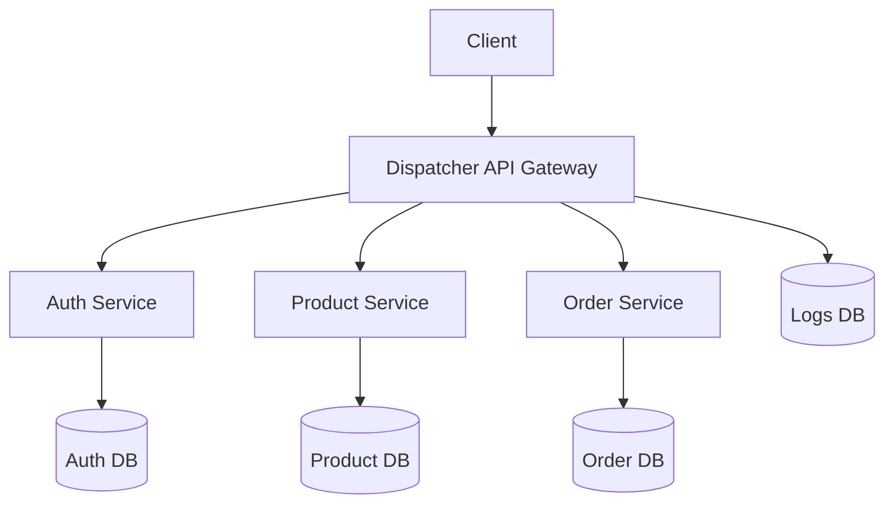
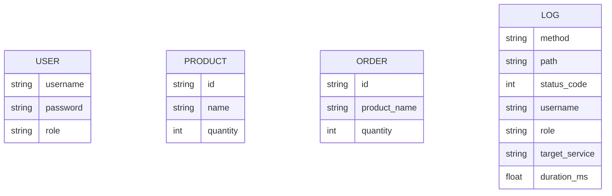
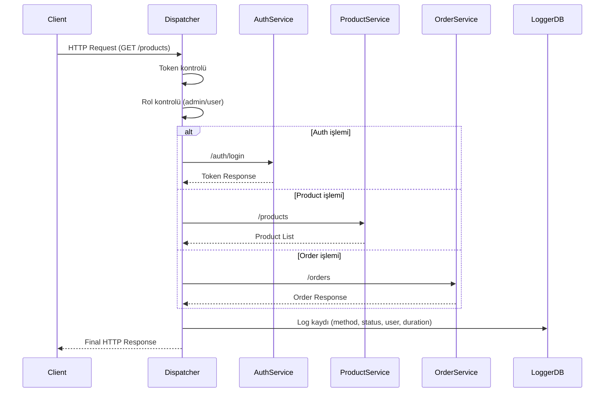

# Mikroservis Tabanlı Ürün ve Sipariş Yönetim Sistemi
## Kocaeli Üniversitesi  Teknoloji Fakültesi Bilişim Sistemleri Mühendisliği

**Ders:** Yazılım Geliştirme Laboratuvarı-II | Proje - I

**Akademik Yıl:** 2025 - 2026 Bahar Yarıyılı  

**Ekip Üyeleri:** Yusuf Çelebi, Zehra Korkmaz 

---

## 1. Giriş

Bu proje, modern yazılım geliştirme süreçlerinde yaygın olarak kullanılan mikroservis mimarisi yaklaşımını uygulamak amacıyla geliştirilmiştir. Sistem; istemciden gelen tüm istekleri merkezi bir Dispatcher (API Gateway) üzerinden yöneten, bağımsız servislerden oluşan, güvenli ve ölçeklenebilir bir yapı sunmaktadır.

Projede temel amaç, monolitik yapılar yerine görevleri ayrılmış mikroservisler kullanarak daha modüler, yönetilebilir ve genişletilebilir bir sistem geliştirmektir. Bu kapsamda kullanıcı doğrulama işlemleri için bir Auth Service, ürün işlemleri için bir Product Service, sipariş işlemleri için bir Order Service ve tüm dış istekleri yöneten bir Dispatcher servisi geliştirilmiştir.

Dispatcher sistemin tek giriş noktası olarak tasarlanmıştır. Yetkilendirme, yönlendirme, hata yönetimi ve loglama işlemleri bu katmanda merkezi olarak ele alınmıştır. Böylece servisler arasındaki sorumluluk ayrımı korunmuş, sistemin güvenliği ve kontrol edilebilirliği artırılmıştır.

Projede ayrıca test güdümlü geliştirme yaklaşımına uygun olarak özellikle Dispatcher bileşeni için testler hazırlanmış, yük testleri profesyonel bir araç olan Locust ile gerçekleştirilmiş ve sistem davranışı farklı trafik seviyelerinde gözlemlenmiştir. Bunun yanında log kayıtları bir arayüz üzerinde görselleştirilmiş, sistem sağlığı için health endpoint’leri eklenmiş ve hata yanıtları standart hale getirilmiştir.

Bu proje ile amaçlanan başlıca kazanımlar şunlardır:

- Mikroservis mimarisinin temel mantığını uygulamak
- Dispatcher üzerinden merkezi trafik yönetimi sağlamak
- Yetkilendirme ve erişim kontrolünü tek merkezde toplamak
- NoSQL veri tabanı kullanarak servis bazlı veri izolasyonu oluşturmak
- Docker ve Docker Compose ile tüm sistemi tek komutla ayağa kaldırmak
- TDD, yük testi, hata yönetimi ve loglama süreçlerini bir arada uygulamak


## 2. Sistem Tasarımı ve Mimari Yaklaşım
Bu projede sistem, mikroservis mimarisi kullanılarak tasarlanmıştır. Mikroservis mimarisi, uygulamanın bağımsız, küçük ve belirli görevleri yerine getiren servisler halinde geliştirilmesini sağlar. Bu yaklaşım sayesinde sistem daha ölçeklenebilir, yönetilebilir ve genişletilebilir hale gelmektedir.

### 2.1 Genel Mimari Yapı
---
Sistem toplamda 4 ana bileşenden oluşmaktadır:

- Dispatcher (API Gateway)
- Auth Service
- Product Service
- Order Service

Tüm dış istekler yalnızca Dispatcher üzerinden sisteme alınmaktadır. Mikroservisler dış dünyaya kapalı olup sadece iç ağ üzerinden Dispatcher ile iletişim kurmaktadır. Bu yapı, sistem güvenliğini artırmakta ve yetkilendirme kontrolünü merkezi hale getirmektedir.


## Sistem Mimarisi


**Şekil 1.** Mikroservis mimarisine sahip sistemin genel yapısı ve bileşenler arası veri akışı


Bu mimari diyagram, sistemin genel bileşenlerini ve bu bileşenler arasındaki veri akışını göstermektedir. İstemciden (Client) gelen tüm istekler doğrudan mikroservislere değil, merkezi bir yapı olan Dispatcher (API Gateway) üzerinden sisteme alınmaktadır.

Dispatcher, gelen isteği analiz ederek ilgili mikroservise (Auth Service, Product Service, Order Service) yönlendirmektedir. Her mikroservis kendi veri tabanına (MongoDB) bağlı çalışmakta olup veri izolasyonu sağlanmaktadır. Ayrıca Dispatcher, sistemde gerçekleşen tüm işlemleri log veritabanına kaydederek sistemin izlenebilirliğini artırmaktadır.

Bu yapı sayesinde sistem daha güvenli, yönetilebilir ve ölçeklenebilir hale getirilmiştir.
### 2.2 Dispatcher (API Gateway)
---
Dispatcher, sistemin tek giriş noktasıdır ve aşağıdaki görevleri yerine getirir:

- İstekleri URL yapısına göre ilgili mikroservise yönlendirme
- Yetkilendirme kontrolü (admin/user ayrımı)
- Hata yönetimi ve uygun HTTP kodlarının döndürülmesi
- Tüm isteklerin loglanması
- Servis sağlık durumlarının kontrolü

Dispatcher içerisinde role-based authorization uygulanmıştır. Örneğin:

Product servisinde POST/PUT/DELETE işlemleri sadece admin kullanıcılar tarafından yapılabilir
Order servisinde PUT/DELETE işlemleri sadece admin tarafından yapılabilir

Bu yapı, sistemde merkezi güvenlik kontrolü sağlamaktadır.

### 2.3 Mikroservisler
---
Sistem üç adet mikroservisten oluşmaktadır:

#### - Auth Service
Kullanıcı kayıt ve giriş işlemlerini gerçekleştirir
Token üretir (token-username-role formatında)
Kullanıcı bilgilerini MongoDB üzerinde saklar
#### - Product Service
Ürün oluşturma, listeleme, güncelleme ve silme işlemlerini yönetir
Her ürün için ayrı veri kaydı oluşturur
#### - Order Service
Sipariş oluşturma, listeleme, güncelleme ve silme işlemlerini yönetir
Ürün adı ve miktar bilgisi içerir

Her servis kendi veri tabanına sahiptir ve veri izolasyonu sağlanmıştır. Servisler arasında veri paylaşımı JSON formatı ile yapılmaktadır.

### 2.4 Veri Tabanı Yapısı (NoSQL)
---
Projede MongoDB kullanılmıştır. Her servis için ayrı veri tabanı kullanılarak veri izolasyonu sağlanmıştır:

- Auth Service → kullanıcı verileri  
- Product Service → ürün verileri  
- Order Service → sipariş verileri  
- Dispatcher → log verileri  

Bu yapı sayesinde servisler birbirinden bağımsız çalışabilmektedir.


**Şekil 2.** Sistem içerisinde kullanılan veri varlıklarını ve veri yapısını gösteren ER diyagramı


Bu ER diyagramı, sistemde kullanılan veri yapısını ve servisler arasındaki veri ayrımını göstermektedir. Her mikroservis kendi veri modeline ve veri tabanına sahiptir, bu da veri izolasyonu ve bağımsızlık sağlamaktadır.

USER varlığı kullanıcı bilgilerini (username, password, role) tutarak kimlik doğrulama ve yetkilendirme işlemlerini desteklemektedir. PRODUCT varlığı sistemdeki ürünleri temsil ederken, ORDER varlığı sipariş işlemlerini ve ürün-miktar ilişkisini yönetmektedir. LOG varlığı ise Dispatcher tarafından tutulan sistem loglarını içermekte olup, isteklerin izlenebilirliğini ve analiz edilebilirliğini sağlamaktadır.

Bu yapı sayesinde sistem hem modüler hem de ölçeklenebilir bir veri mimarisi sunmaktadır.

### 2.5 REST ve Richardson Maturity Model (RMM)
---
Projede RESTful API prensiplerine uyulmuştur. Tüm işlemler uygun HTTP metodları ile gerçekleştirilmiştir:

- GET → veri okuma   
- POST → veri oluşturma  
- PUT → veri güncelleme  
- DELETE → veri silme

Sistem API Gateway (Dispatcher) üzerinden çalıştığı için Swagger arayüzünde endpointler /{full_path} formatında görünmektedir. Ancak sistem içerisinde aşağıdaki gerçek endpointler kullanılmaktadır:

Projede Kullanılan Endpointler

#### Auth Service
- POST /auth/register
- POST /auth/login

#### Product Service
- GET /products
- POST /products (admin)
- PUT /products/{id} (admin)
- DELETE /products/{id} (admin)

#### Order Service
- GET /orders
- POST /orders
- PUT /orders/{id} (admin)
- DELETE /orders/{id} (admin)

Bu yapı Richardson Maturity Model Seviye 2’ye uygundur.


### 2.6 Nesne Yönelimli Programlama (OOP)
---
Proje geliştirilirken OOP prensiplerine dikkat edilmiştir:

- Her servis bağımsız sorumluluğa sahiptir (Single Responsibility)
- Dispatcher yönlendirme işlemlerini soyutlayan Gateway sınıfı kullanılmıştır
- Logger sınıfı ile loglama işlemleri ayrı bir yapı olarak tasarlanmıştır

Bu sayede kod daha okunabilir, sürdürülebilir ve genişletilebilir hale gelmiştir.

### 2.7 Test-Driven Development (TDD)
---
Dispatcher servisi için test güdümlü geliştirme yaklaşımı uygulanmıştır.

Test süreci şu şekilde ilerlemiştir:

- Önce test yazılmıştır (Red)  
- Testi geçecek kod geliştirilmiştir (Green)  
- Kod düzenlenmiş ve iyileştirilmiştir (Refactor)    

Dispatcher yönlendirme mekanizması için pytest kullanılarak testler yazılmıştır.

### 2.8 Sistem Akış Mantığı
---
Sistemde bir isteğin işlenme süreci şu şekildedir:

1. İstek Dispatcher’a gelir  
2. Token kontrolü yapılır  
3. Kullanıcı rolü belirlenir  
4. Yetki kontrolü yapılır  
5. İstek ilgili mikroservise yönlendirilir  
6. Mikroservis yanıt üretir  
7. Dispatcher log kaydı oluşturur  
8. Yanıt kullanıcıya döner



**Şekil 3.** İstemciden gelen bir isteğin Dispatcher üzerinden işlenme sürecini gösteren sequence diyagramı


Bu diyagram, sistemde bir isteğin Dispatcher üzerinden nasıl işlendiğini göstermektedir. İstemciden gelen istek öncelikle Dispatcher tarafından karşılanır. Token ve rol kontrolü yapıldıktan sonra istek ilgili mikroservise yönlendirilir. Mikroservisten gelen yanıt Dispatcher üzerinden kullanıcıya iletilir. Ayrıca tüm istekler log veritabanına kaydedilerek sistem izlenebilir hale getirilir.


## 3. Modüllerin Detaylı Açıklaması

Bu bölümde sistem içerisinde yer alan ana bileşenler ve bu bileşenlerin görevleri detaylı olarak açıklanmaktadır.

### 3.1 Dispatcher (API Gateway)

Dispatcher, sistemin merkezi kontrol noktasıdır. Tüm istemci istekleri ilk olarak bu bileşene ulaşır. Dispatcher, gelen isteğin hedef servisini belirler ve isteği ilgili mikroservise yönlendirir.

Dispatcher içerisinde aşağıdaki işlemler gerçekleştirilmektedir:

- URL bazlı yönlendirme (routing)
- Yetkilendirme kontrolü (admin / user)
- Hata yönetimi
- Loglama işlemleri
- Servis sağlık kontrolleri

Dispatcher bileşeni içerisinde yer alan yönlendirme mekanizması, `DispatcherGateway` sınıfı ile gerçekleştirilmiştir. 
Bu yapı sayesinde sistemde merkezi bir trafik kontrolü sağlanmıştır.

---

### 3.2 Gateway (Routing Mekanizması)

Gateway bileşeni, Dispatcher içerisinde yer almakta olup gelen isteklerin hangi mikroservise yönlendirileceğini belirlemektedir.

Örneğin:

- `/products` → product_service
- `/auth` → auth_service
- `/orders` → order_service

Bu yönlendirme işlemi `resolve_target` fonksiyonu ile yapılmaktadır.

Gateway ayrıca HTTP isteklerini ilgili servislere iletmek için `httpx` kütüphanesini kullanmaktadır.

---

### 3.3 Logger (Loglama Mekanizması)

Logger bileşeni, sistemde gerçekleşen tüm istekleri kayıt altına almaktadır.

Her log kaydı aşağıdaki bilgileri içermektedir:

- HTTP method
- endpoint (path)
- status code
- kullanıcı bilgisi
- kullanıcı rolü
- hedef servis
- hata mesajı
- işlem süresi (ms)

Bu loglar MongoDB üzerinde saklanmaktadır. Loglama işlemi `RequestLogger` sınıfı ile gerçekleştirilmektedir. 

Bu yapı sayesinde sistem davranışı analiz edilebilmekte ve hatalar kolayca tespit edilebilmektedir.

---

### 3.4 Dashboard (Log Görselleştirme)

Dashboard bileşeni, log verilerini kullanıcı dostu bir arayüz ile göstermektedir.

Dashboard üzerinde şu bilgiler yer almaktadır:

- Toplam istek sayısı
- Başarılı istekler
- Yetkisiz erişimler
- Hatalı istekler
- Ortalama işlem süresi
- Son log kayıtları

Dashboard HTML çıktısı `build_dashboard_html` fonksiyonu ile oluşturulmaktadır. 


---

### 3.5 Auth Service

Auth Service, kullanıcı yönetimi ve kimlik doğrulama işlemlerinden sorumludur.

Bu servis:

- kullanıcı kaydı oluşturur
- kullanıcı girişini kontrol eder
- token üretir

Token formatı: token-username-role  
Bu token Dispatcher tarafından doğrulanarak yetkilendirme sağlanmaktadır. 

---

### 3.6 Product Service

Product Service, ürün yönetimi işlemlerinden sorumludur.

Bu servis:

- ürün ekleme
- ürün listeleme
- ürün güncelleme
- ürün silme

işlemlerini gerçekleştirmektedir.

Veriler MongoDB üzerinde `products` koleksiyonunda saklanmaktadır.  

---

### 3.7 Order Service

Order Service, sipariş yönetimi işlemlerinden sorumludur.

Bu servis:

- sipariş oluşturma
- sipariş listeleme
- sipariş güncelleme
- sipariş silme

işlemlerini gerçekleştirmektedir.

Sipariş verileri MongoDB üzerinde saklanmaktadır. 

---

### 3.8 Yük Testi (Locust)

Sistemin performansını test etmek amacıyla Locust aracı kullanılmıştır.

Test senaryosunda:

- ürün listeleme
- sipariş oluşturma
- admin işlemleri

eş zamanlı kullanıcılar ile test edilmiştir.

Test senaryosu `locustfile.py` içerisinde tanımlanmıştır. 


## 4. Uygulamaya Ait Açıklamalar, Test Senaryoları ve Sonuçlar

Bu bölümde geliştirilen sistem üzerinde gerçekleştirilen fonksiyonel testler, yük testleri ve arayüz çıktıları değerlendirilmiştir. Testler sırasında sistemin yönlendirme doğruluğu, yetkilendirme mekanizması, loglama yapısı ve performans davranışı gözlemlenmiştir.

### 4.1 Sistem Yapısı ve Container Mimarisi

Sistem Docker ve Docker Compose kullanılarak container bazlı çalışacak şekilde yapılandırılmıştır. Tüm servisler tek komut ile ayağa kaldırılabilmektedir.

Kullanılan servisler şunlardır:

- Dispatcher
- Auth Service
- Product Service
- Order Service
- MongoDB

Aşağıdaki görselde sistemin aktif container yapısı gösterilmektedir.


**Şekil 4.** Docker Compose ile çalışan mikroservis container yapısı

Bu yapı, mikroservislerin birbirinden bağımsız ancak aynı ağ üzerinde kontrollü biçimde çalıştığını göstermektedir. Dış dünyaya yalnızca Dispatcher açık bırakılmış, diğer servisler iç ağda tutulmuştur. Böylece proje isterlerinde belirtilen network isolation yaklaşımı sağlanmıştır.


---

### 4.2 Swagger Arayüzü ve API Doğrulaması

Sistemin API uç noktaları Swagger arayüzü üzerinden görüntülenmiş ve test edilmiştir. Swagger ekranında endpointlerin `System`, `Admin` ve `Gateway` başlıkları altında gruplandığı görülmektedir.


**Şekil 5.** Dispatcher API için Swagger arayüzü


Bu arayüz, sistemin RESTful yapıda geliştirildiğini ve endpointlerin düzenli biçimde sunulduğunu göstermektedir. Özellikle `GET`, `POST`, `PUT` ve `DELETE` metotlarının kaynak bazlı kullanılması, Richardson Maturity Model Seviye 2 ile uyumludur.

---

### 4.3 Dispatcher TDD ve Pytest Sonuçları

Dispatcher bileşeni için test güdümlü geliştirme yaklaşımı benimsenmiştir. Bu kapsamda önce yönlendirme mantığını doğrulayan testler yazılmış, ardından bu testleri geçecek fonksiyonel kod geliştirilmiştir.


**Şekil 6.** Dispatcher servisine ait pytest testlerinin başarılı şekilde çalıştırılması

Dispatcher bileşeni için yönlendirme mekanizmasını doğrulamak amacıyla pytest tabanlı testler yazılmıştır. Test dosyası içerisinde gateway yönlendirme mantığı kontrol edilmiş ve ilgili hedef servise doğru yönlendirme yapıldığı doğrulanmıştır. Testlerin başarılı şekilde geçmesi, Dispatcher bileşeninin temel işlevlerinin beklendiği gibi çalıştığını göstermektedir.

Pytest ile yapılan testlerde Dispatcher’ın:
- doğru servise yönlendirme yapması
- tanımsız route’ları ayırt etmesi
- yönlendirme sonucunda beklenen çıktıyı üretmesi

doğrulanmıştır.

Bu sonuç, Dispatcher bileşeninin temel işlevlerinin beklenen şekilde çalıştığını göstermektedir.

---

### 4.4 Dashboard ve Log Analizi

Sistem içerisinde gerçekleşen istekler Dispatcher üzerinde loglanmış ve dashboard arayüzü ile görselleştirilmiştir. Dashboard üzerinde toplam istek sayısı, başarılı istek oranı, hata kodları, ortalama işlem süresi, en sık kullanılan servisler ve log kayıtları gösterilmektedir.


**Şekil 7.** Dispatcher dashboard genel özet kartları ve son log kayıtları

---


**Şekil 8.** Request Distribution ve Service Request Distribution grafikleri

---


**Şekil 9.** Top 5 Endpoints ve Top 5 Error Endpoints tabloları

---

Dashboard verilerine göre:
- toplam istek sayısı yüksek seviyededir
- başarılı istek oranı baskındır
- sistemde en yoğun kullanılan servis `product_service` olmuştur
- hata kayıtları izlenebilir biçimde tutulmuştur
- en çok kullanılan endpoint ve en çok hata alınan endpoint analiz edilebilmiştir

Bu yapı sayesinde sistem sadece çalıştırılmakla kalmamış, aynı zamanda gözlemlenebilir hale getirilmiştir.

---

### 4.5 Fonksiyonel Test Senaryoları

Sistem üzerinde temel işlevlerin doğruluğunu kontrol etmek amacıyla çeşitli fonksiyonel test senaryoları uygulanmıştır.

#### Senaryo 1: Kullanıcı Girişi (Authentication Testi)

Bu senaryoda sistemin kimlik doğrulama mekanizması test edilmiştir. `/auth/login` endpointi kullanılarak hem admin hem de normal kullanıcı giriş işlemleri gerçekleştirilmiştir.

Yapılan testlerde:
- Doğru kullanıcı adı ve şifre ile başarılı giriş sağlanmış ve sistem tarafından token üretildiği gözlemlenmiştir  
- Üretilen token’ın `token-username-role` formatında olduğu doğrulanmıştır  
- Hatalı kullanıcı bilgileri ile yapılan giriş denemelerinde sistemin uygun hata mesajı döndürdüğü görülmüştür  

Bu sonuçlar, Auth Service bileşeninin kimlik doğrulama işlemlerini doğru ve güvenli bir şekilde gerçekleştirdiğini göstermektedir.


**Şekil 10.** Başarılı kullanıcı girişi sonucunda token üretilmesi


**Şekil 11.** Hatalı kullanıcı bilgileri ile giriş denemesinde alınan hata yanıtı

---

#### Senaryo 2: Ürün Listeleme (Product Retrieval Testi)

Bu senaryoda sistemin ürün listeleme işlevi test edilmiştir. `/products` endpointi kullanılarak mevcut ürünlerin listelenmesi sağlanmıştır.

Yapılan testlerde:
- Kullanıcı rolüne sahip hesaplar ile endpoint’e istek gönderilmiş ve sistemin başarılı şekilde yanıt verdiği gözlemlenmiştir  
- Ürün verilerinin doğru formatta (JSON) ve eksiksiz şekilde döndüğü doğrulanmıştır  
- Endpoint’in herhangi bir yetki hatası üretmeden erişilebilir olduğu görülmüştür  

Bu sonuçlar, Product Service bileşeninin veri okuma (GET) işlemlerini doğru şekilde gerçekleştirdiğini ve kullanıcı seviyesinde erişime açık olduğunu göstermektedir.


**Şekil 12.** `/products` endpointi üzerinden başarılı ürün listeleme çıktısı

---

#### Senaryo 3: Ürün İşlemlerinde Yetkilendirme Kontrolü (Authorization Testi)

Bu senaryoda sistemde uygulanan rol tabanlı yetkilendirme (role-based authorization) mekanizması test edilmiştir. `/products` endpointi üzerinde ürün ekleme, güncelleme ve silme işlemleri farklı kullanıcı rolleri ile denenmiştir.

Yapılan testlerde:
- Normal kullanıcı rolü ile `POST /products`, `PUT /products/{id}` ve `DELETE /products/{id}` istekleri gönderilmiş ve sistemin bu işlemleri engelleyerek `403 Forbidden` hatası döndürdüğü gözlemlenmiştir  
- Aynı işlemler admin rolüne sahip kullanıcı ile tekrar denenmiş ve tüm işlemlerin başarılı şekilde gerçekleştirildiği doğrulanmıştır  
- Böylece yalnızca yetkili kullanıcıların veri üzerinde değişiklik yapabildiği sistem tarafından doğru şekilde uygulanmıştır  

Bu sonuçlar, Dispatcher üzerinde tanımlanan yetkilendirme mekanizmasının doğru çalıştığını ve sistem güvenliğinin sağlandığını göstermektedir.


**Şekil 13.** Normal kullanıcı ile yapılan ürün işlemlerinde alınan `403 Forbidden` hatası


**Şekil 14.** Admin kullanıcı ile ürün ekleme işleminin başarılı şekilde gerçekleştirilmesi

---

#### Senaryo 4: Sipariş Oluşturma ve Yönetme (Order Management & Authorization Testi)

Bu senaryoda sipariş işlemlerinin doğruluğu ve rol tabanlı yetkilendirme mekanizmasının Order Service üzerindeki etkisi test edilmiştir. `/orders` endpointi kullanılarak sipariş oluşturma, güncelleme ve silme işlemleri farklı kullanıcı rolleri ile denenmiştir.

Yapılan testlerde:
- Normal kullanıcı rolü ile `POST /orders` isteği gönderilmiş ve sipariş oluşturma işleminin başarılı şekilde gerçekleştiği gözlemlenmiştir  
- Aynı kullanıcı ile `PUT /orders/{id}` ve `DELETE /orders/{id}` işlemleri denendiğinde sistemin bu işlemleri engelleyerek yetki hatası verdiği görülmüştür  
- Admin rolüne sahip kullanıcı ile yapılan güncelleme ve silme işlemlerinin ise başarılı şekilde gerçekleştirildiği doğrulanmıştır  

Bu sonuçlar, sipariş oluşturma işlemlerinin kullanıcı seviyesinde açık olduğunu, ancak veri değişikliği gerektiren kritik işlemlerin yalnızca admin yetkisi ile sınırlandırıldığını göstermektedir. Böylece sistemde tanımlanan role-based authorization mekanizmasının doğru şekilde çalıştığı doğrulanmıştır.


**Şekil 15.** Normal kullanıcı ile sipariş oluşturma işleminin başarılı şekilde gerçekleştirilmesi


**Şekil 16.** Yetkisiz  ve yetkili kullanıcı ile sipariş güncelleme denemelerinde alınan yanıtlar

---

#### Senaryo 5: Sistem Sağlık Kontrolü (Health Check Testi)

Bu senaryoda sistemin genel sağlık durumu ve servislerin aktif çalışma durumu test edilmiştir. Dispatcher ve bağlı mikroservislerin sağlık kontrol endpointleri üzerinden sistemin durumu gözlemlenmiştir.

Yapılan testlerde:
- Dispatcher üzerinden sağlık kontrolü gerçekleştirilmiş ve sistemin aktif durumda olduğu doğrulanmıştır  
- Mikroservislerin erişilebilir olduğu ve düzgün şekilde yanıt verdiği gözlemlenmiştir  
- Sistem bileşenlerinin çalışır durumda olduğu başarılı şekilde raporlanmıştır  

Bu sonuçlar, sistemin çalışma anında servislerin izlenebilir olduğunu ve herhangi bir servis kesintisinin tespit edilebilir olduğunu göstermektedir.


**Şekil 17.** Sistem sağlık kontrolü sonucunda servislerin aktif durumunun görüntülenmesi


Bu testler sonucunda sistemin temel işlevlerinin ve yetki yapısının beklenen şekilde çalıştığı doğrulanmıştır.

---

### 4.6 Yük Testi Sonuçları

Sistemin yoğun trafik altındaki davranışını ölçmek amacıyla Locust aracı kullanılmıştır. Proje isterlerine uygun olarak sistem 50, 100, 200 ve 500 eş zamanlı kullanıcı altında test edilmiştir.

Locust senaryosunda aşağıdaki işlemler eş zamanlı olarak gerçekleştirilmiştir:

- kullanıcı girişi (`POST /auth/login`)
- ürün listeleme (`GET /products`)
- sipariş oluşturma (`POST /orders`)
- admin yetkisi ile ürün oluşturma (`POST /products`)

---

#### 4.6.1 50 Kullanıcılı Test


**Şekil 18.** Locust 50 kullanıcı testi sonuç ekranı

50 eş zamanlı kullanıcı altında sistem kararlı çalışmıştır. Bu testte toplam hata oranı `%0` olarak gözlemlenmiştir. Ekran çıktısına göre toplam ortalama yanıt süresi yaklaşık `84.85 ms` seviyesindedir. `GET /products` endpointi en yoğun kullanılan endpointlerden biri olmuş, ancak sistem bu yük altında stabil biçimde çalışmıştır.

Öne çıkan değerler:

- `POST /auth/login` ortalama süre: `229.27 ms`
- `POST /orders` ortalama süre: `76.89 ms`
- `GET /products` ortalama süre: `84.17 ms`
- `POST /products` ortalama süre: `76.64 ms`
- Toplam ortalama süre: `84.85 ms`
- Hata oranı: `%0`

Bu sonuç, sistemin düşük ve orta seviyeli trafik altında başarılı şekilde çalıştığını göstermektedir.

---

#### 4.6.2 100 Kullanıcılı Test


**Şekil 19.** Locust 100 kullanıcı testi sonuç ekranı

100 eş zamanlı kullanıcı altında sistem çalışmaya devam etmiş ve hata oranı `%0` olarak korunmuştur. Ancak kullanıcı sayısının artmasıyla birlikte ortalama yanıt sürelerinde yükselme gözlenmiştir. Bu, sistemin yük artışına bağlı olarak performans kaybı yaşadığını ancak hala kararlı olduğunu göstermektedir.

Öne çıkan değerler:

- `POST /auth/login` ortalama süre: `348.09 ms`
- `POST /orders` ortalama süre: `95.31 ms`
- `GET /products` ortalama süre: `136.15 ms`
- `POST /products` ortalama süre: `118.06 ms`
- Toplam ortalama süre: `127.56 ms`
- Hata oranı: `%0`

Bu aşamada sistem halen kullanılabilir ve stabil durumdadır.

---

#### 4.6.3 200 Kullanıcılı Test


**Şekil 20.** Locust 200 kullanıcı testi sonuç ekranı

200 eş zamanlı kullanıcı altında sistemin performansı analiz edilmiştir. Bu testte sistemin hata üretmeden çalışmaya devam ettiği gözlemlenmiştir.

Öne çıkan değerler:

- `POST /auth/login` ortalama süre: `1530.27 ms`
- `POST /orders` ortalama süre: `628.62 ms`
- `GET /products` ortalama süre: `1820.53 ms`
- `POST /products` ortalama süre: `1728.42 ms`
- Toplam ortalama süre: `1462.01 ms`
- Hata oranı: `%0`

Bu sonuçlar, sistemin 200 kullanıcı seviyesinde hata üretmeden çalışabildiğini ancak yanıt sürelerinin önemli ölçüde arttığını göstermektedir. Özellikle ürün servisinde (`/products`) yanıt sürelerinin yükselmesi, sistemin bu noktada yoğunluk yaşamaya başladığını göstermektedir.

Genel olarak sistem bu seviyede stabil çalışmakta ancak performans açısından optimize edilmesi gereken noktalar ortaya çıkmaktadır.

---
#### 4.6.4 500 Kullanıcılı Test


**Şekil 21.** Locust 500 kullanıcı testi sonuç ekranı

500 eş zamanlı kullanıcı altında sistemin zorlanmaya başladığı gözlemlenmiştir. Bu testte toplam hata oranı yaklaşık `%32` seviyesine çıkmıştır. Özellikle `GET /products` ve `POST /products` endpointlerinde yüksek hata sayıları görülmüştür. Ayrıca ortalama yanıt süreleri ciddi şekilde artmıştır.

Öne çıkan değerler:

- `POST /auth/login` ortalama süre: `12201.06 ms`
- `POST /orders` ortalama süre: `2706.65 ms`
- `GET /products` ortalama süre: `6334.02 ms`
- `POST /products` ortalama süre: `6077.29 ms`
- Toplam ortalama süre: `6111.55 ms`
- Toplam hata sayısı: `2523`
- Hata oranı: yaklaşık `%32`

Bu sonuç, sistemin 500 kullanıcı gibi yüksek yük altında performans açısından zorlandığını ve hata oranının arttığını göstermektedir.

---

#### 4.6.5 Karşılaştırmalı Değerlendirme

Yük testleri birlikte değerlendirildiğinde aşağıdaki sonuçlara ulaşılmıştır:

| Kullanıcı Sayısı | Toplam Ortalama Süre (ms) | Hata Oranı | Genel Durum |
|---|---:|---:|---|
| 50 | 84.85 | %0 | Kararlı |
| 100 | 127.56 | %0 | Kararlı |
| 200 | 1462.01 | %0 | Stabil fakat yavaşlıyor |
| 500 | 6111.55 | %32 | Zorlanıyor |

Genel olarak sistem 50 ve 100 kullanıcı seviyelerinde hızlı ve kararlı çalışmıştır. 200 kullanıcı seviyesinde sistem hata üretmeden çalışmaya devam etmiş ancak yanıt sürelerinde ciddi bir artış gözlemlenmiştir. 500 kullanıcı seviyesinde ise sistemin performans sınırlarına ulaştığı, yanıt sürelerinin çok yükseldiği ve hata oranının arttığı görülmüştür.

Bu sonuçlar, sistemin orta seviyeli yük altında stabil olduğunu ancak yüksek trafik altında performans optimizasyonuna ihtiyaç duyduğunu göstermektedir.

---

### 4.7 Hata Yönetimi ve Standart Yanıtlar

Proje isterlerine uygun biçimde hata durumlarında her zaman `200 OK` dönülmemiş, uygun HTTP durum kodları kullanılmıştır.

Sistemde aşağıdaki hata senaryoları test edilmiştir:
- yetkisiz erişim → `401 Unauthorized`
- rol yetersizliği → `403 Forbidden`
- hatalı kaynak kimliği → `400 Bad Request`
- bulunamayan veri → `404 Not Found`
- servis erişim problemi → `502 Bad Gateway` benzeri hata davranışları

Ayrıca hata yanıtları standart hale getirilmiş ve mümkün olduğunca şu format korunmuştur:

```json
{"error": "mesaj"}

```
---


## 5. Sonuç ve Tartışma

Bu projede mikroservis mimarisi yaklaşımı kullanılarak ürün ve sipariş yönetim sistemi başarıyla geliştirilmiştir. Sistem; Dispatcher, Auth Service, Product Service ve Order Service bileşenlerinden oluşan modüler bir yapı ile tasarlanmıştır.

Projede elde edilen temel kazanımlar şunlardır:

- Tüm dış isteklerin Dispatcher üzerinden merkezi olarak yönetilmesi sağlanmıştır
- Yetkilendirme kontrolleri merkezi hale getirilmiştir
- Her servis için ayrı MongoDB veri yapısı kullanılarak veri izolasyonu sağlanmıştır
- Docker Compose ile sistem tek komutla ayağa kaldırılabilir hale getirilmiştir
- TDD yaklaşımı Dispatcher üzerinde uygulanmıştır
- Pytest ile testler gerçekleştirilmiştir
- Locust ile performans ve yük testleri yapılmıştır
- Dashboard üzerinden log ve trafik analizi görselleştirilmiştir
- Hata yönetimi uygun HTTP kodları ile standart hale getirilmiştir

### 5.1 Başarılar

Projenin güçlü yönleri şunlardır:

- Mikroservis mantığının başarılı şekilde uygulanması
- Dispatcher üzerinden güvenli ve merkezi kontrol sağlanması
- RESTful API prensiplerine uygun endpoint tasarımı
- Yük testi ve dashboard gibi ek profesyonel özelliklerin sisteme dahil edilmesi
- Swagger arayüzü ile API’nin kolay test edilebilir olması

### 5.2 Sınırlılıklar

Mevcut sistem çalışır durumdadır ancak bazı sınırlılıkları bulunmaktadır:

- Kimlik doğrulama yapısı gerçek JWT yerine basitleştirilmiş token mantığı ile kurulmuştur
- Dashboard özel amaçlı geliştirilmiş olup daha ileri izleme araçları ile geliştirilebilir
- Mikroservisler için otomatik ölçekleme ve dağıtık izleme yapılmamıştır
- TDD yaklaşımı Dispatcher üzerinde uygulanmış olsa da tüm servisler için genişletilebilir

### 5.3 Gelecek Geliştirmeler

İleride sistem üzerinde aşağıdaki geliştirmeler yapılabilir:

- JWT tabanlı güvenli authentication altyapısına geçiş
- Role ve permission yapısının daha ayrıntılı hale getirilmesi
- Prometheus ve Grafana entegrasyonu ile daha gelişmiş monitoring
- CI/CD süreçlerinin eklenmesi
- Test kapsamının integration ve end-to-end testlere genişletilmesi
- Mikroservislerin Kubernetes benzeri bir yapı üzerinde ölçeklenmesi

Sonuç olarak bu proje, modern yazılım geliştirme yaklaşımlarının; mikroservis mimarisi, merkezi gateway kullanımı, test, yük analizi, loglama ve gözlemlenebilirlik gibi önemli bileşenlerini bir araya getiren başarılı bir uygulama olmuştur.
